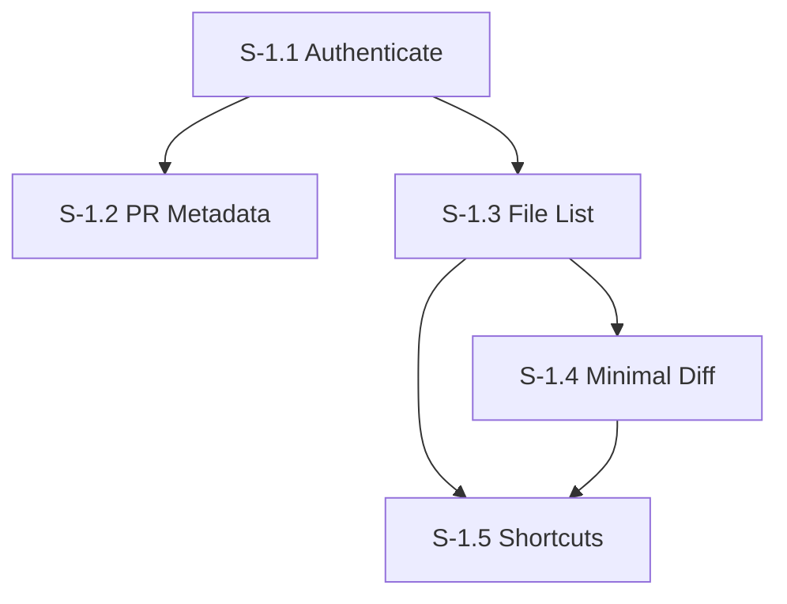

# Milestone 1: SPA with GitHub Data & Minimal Diff

**Goal**: Create a standalone Single Page Application (SPA) that authenticates with GitHub, fetches Pull Request data, and displays a read-only diff view using the GitHub API model.

**Horizontal Requirements** (Applies to all stories):
- **Test Coverage**: Minimum 70% unit test coverage for all new code.
- **E2E Testing**: At least one Playwright/Cypress test per Acceptance Criteria.
- **Accessibility**:
  - Semantic HTML (headings, landmarks, lists).
  - Keyboard navigation (Tab order, focus indicators, shortcuts where applicable).
  - Screen reader support (ARIA labels, roles).
  - High Contrast mode support (verified with OS settings or CSS media queries).

  - High Contrast mode support (verified with OS settings or CSS media queries).

## Dependency Graph

---

## [S-1.1] Story 1.1: Authenticate with GitHub

As a user, I want to authenticate with my GitHub account so that I can access private repositories and avoid rate limits.

### Description
Implement an authentication flow using GitHub OAuth or Personal Access Token (PAT). For this milestone, a simple PAT input field or OAuth flow that stores the token in local storage is sufficient to unblock data fetching.

### Acceptance Criteria
1.  **Input Mechanism**:
    - [ ] [AC-1.1.1] User sees a "Connect to GitHub" screen on launch if not authenticated.
    - [ ] [AC-1.1.2] Option to input a Personal Access Token (PAT).
    - [ ] [AC-1.1.3] **Validation**: Verify token format (begins with `ghp_` or `github_pat_`).
2.  **State Management**:
    - [ ] [AC-1.1.4] Token is persisted securely (e.g., `localStorage` only if acceptable for prototype, otherwise session only - assume `localStorage` for M1 SPA).
    - [ ] [AC-1.1.5] Application detects valid session on reload and skips login screen.
3.  **Error Handling**:
    - [ ] [AC-1.1.6] Invalid token shows a clear error message ("Authentication failed. Please check your token.").
    - [ ] [AC-1.1.7] Network error shows "Connection failed".
4.  **Accessibility**:
    - [ ] [AC-1.1.8] Input field has accessible label (`<label for="pat">`).
    - [ ] [AC-1.1.9] Error messages are announced via `aria-live="polite"`.
    - [ ] [AC-1.1.10] Focus moves to the error message or back to input on failure.

---

## [S-1.2] Story 1.2: View PR Metadata (Read-Only)

As a reviewer, I want to see the high-level details of the Pull Request (Title, Description, Status) so that I understand the context of the changes.

### Description
Fetch and display the PR manifest from `GET /repos/{owner}/{repo}/pulls/{number}`.

### Acceptance Criteria
1.  **Data Display**:
    - [ ] [AC-1.2.1] Display PR Title (H1).
    - [ ] [AC-1.2.2] Display PR Description (Markdown rendered).
    - [ ] [AC-1.2.3] Display Author Avatar and Name.
    - [ ] [AC-1.2.4] Display State (Open/Closed/Merged) with distinct visual badges (Green/Red/Purple).
    - [ ] [AC-1.2.5] Display Source and Target branches (`feature-x` into `main`).
2.  **Navigation**:
    - [ ] [AC-1.2.6] Link back to original GitHub PR URL.
3.  **Loading State**:
    - [ ] [AC-1.2.7] Skeleton loader or spinner while fetching metadata.
4.  **Accessibility**:
    - [ ] [AC-1.2.8] Headings hierarchy is correct (Title is H1).
    - [ ] [AC-1.2.9] Status badges use high-contrast colors and text labels (not just color).
    - [ ] [AC-1.2.10] Links have descriptive text (e.g., "View on GitHub" not "Click here").

---

## [S-1.3] Story 1.3: View Changed Files List

As a reviewer, I want to see a list of modified files grouped by folder so that I can navigate specifically to the parts of the code I care about.

### Description
Fetch the list of files from `GET /repos/{owner}/{repo}/pulls/{number}/files`. Display them in a tree or list view.

### Acceptance Criteria
1.  **File Listing**:
    - [ ] [AC-1.3.1] List all changed files with their paths.
    - [ ] [AC-1.3.2] Show change type icons/labels (Added, Modified, Deleted, Renamed).
    - [ ] [AC-1.3.3] Show additions/deletions stats (+10 / -5) per file.
2.  **Interactivity**:
    - [ ] [AC-1.3.4] Clicking a file navigates to the Diff View for that file (Story 1.4).
    - [ ] [AC-1.3.5] Selected file is visually highlighted.
3.  **Performance**:
    - [ ] [AC-1.3.6] Handle PRs with 50+ files without UI freezing.
4.  **Accessibility**:
    - [ ] [AC-1.3.7] File list is keyboard navigable (Up/Down arrow keys).
    - [ ] [AC-1.3.8] Current selection is indicated via `aria-selected="true"`.
    - [ ] [AC-1.3.9] Screen reader announces filename and change stats (e.g., "utils.ts, modified, 10 additions").

---

## [S-1.4] Story 1.4: Minimal Diff View (Unified)

As a reviewer, I want to see the code changes for a selected file in a unified view so that I can verify the logic.

### Description
Fetch the file content and/or patch data. GitHub API returns `patch` field in the file list response, which contains the unified diff fragment. Render this patch with syntax highlighting.
*Note: This story focuses on the "minimal" api-aligned diff, i.e., rendering the patch provided by GitHub, not computing a full side-by-side diff from raw file contents yet.*

### Acceptance Criteria
1.  **Rendering**:
    - [ ] [AC-1.4.1] Render the git patch text (Unified view).
    - [ ] [AC-1.4.2] Highlight added lines in green (background).
    - [ ] [AC-1.4.3] Highlight deleted lines in red (background).
    - [ ] [AC-1.4.4] Display line numbers on the left.
    - [ ] [AC-1.4.5] Syntax highlighting for minimal common languages (JS/TS/Python).
2.  **Whitespace**:
    - [ ] [AC-1.4.6] Preserve indentation exactly as in the patch.
3.  **Scrolling**:
    - [ ] [AC-1.4.7] Horizontal scroll for long lines.
4.  **Accessibility**:
    - [ ] [AC-1.4.8] Code block is accessible to screen readers (not just a canvas or image).
    - [ ] [AC-1.4.9] Added/Deleted lines have accessible markup (e.g., `Added` or `aria-label`).
    - [ ] [AC-1.4.10] High contrast theme works (Green/Red distinguishable by more than just color, e.g., +/- markers in gutter).

---

## [S-1.5] Story 1.5: Keyboard Navigation & Shortcuts

As a power user, I want to navigate between files and diffs using the keyboard so that I can review quickly.

### Description
Implement global shortcuts for common actions.

### Acceptance Criteria
1.  **Shortcuts**:
    - [ ] [AC-1.5.1] `j` / `k`: Next / Previous file in the file list.
    - [ ] [AC-1.5.2] `Space`: Scroll down in diff view.
2.  **Focus Management**:
    - [ ] [AC-1.5.3] Shortcuts work when focus is on the `body` or specific containers, but do not trigger if user is in an input field (if any).
3.  **Documentation**:
    - [ ] [AC-1.5.4] "Show Shortcuts" (?) modal listing available keys.
4.  **Accessibility**:
    - [ ] [AC-1.5.5] Shortcuts are documented in a way screen readers can find.
