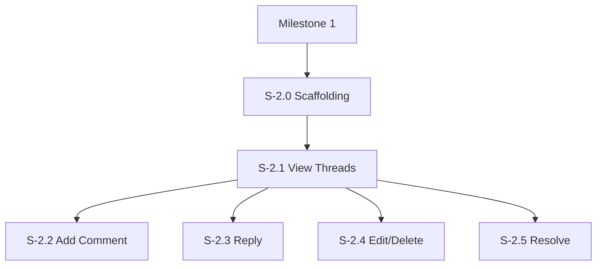

# Milestone 2: Minimal Commenting Capabilities

**Goal**: accurate replicate GitHub's commenting experience within the SPA, allowing users to view, add, reply to, and manage comments on code diffs.

**Horizontal Requirements** (Applies to all stories):
- **Test Coverage**: Minimum 70% unit test coverage.
- **E2E Testing**: Critical paths (add/reply/delete) covered by Playwright/Cypress.
- **Accessibility**:
  - Comment buttons and threads are keyboard accessible.
  - Screen readers announce comment author, timestamp, and content.
  - ARIA live regions for successful comment posting.

  - ARIA live regions for successful comment posting.

## Architecture & Scaffolding
*Implementation must follow `spec/ARCHITECTURE.md`. Focus on `features/comments` module.*

## Dependency Graph

---

## [S-2.0] Story 2.0: Comments Feature Scaffolding

As a developer, I want to establish the data structures and stores for comments so that UI components have a reliable data source.

### Description
Create the `features/comments` directory structure. Define TypeScript interfaces for GitHub Review Comments. Implement `useCommentsStore`.

### Acceptance Criteria
1.  **Data Structure**:
    - [ ] [AC-2.0.1] `types.ts` defines `Comment`, `ReviewThread`.
2.  **State Management**:
    - [ ] [AC-2.0.2] `useCommentsStore` implemented with mock data capabilities or API stubs.
    - [ ] [AC-2.0.3] Helpers functions to map "Diff Line Index" to "Comment Position".

---

## [S-2.1] Story 2.1: View Comment Threads on Diff

As a reviewer, I want to see existing conversation threads positioned next to the relevant code lines so that I can participate in the review.

### Description
Fetch review comments from `GET /repos/{owner}/{repo}/pulls/{number}/comments`. Map them to the correct line numbers in the diff view. Display them either inline (expanding the code rows) or as an overlay/bubble depending on the specific UI design chosen (assuming "Minimal" means roughly inline for now to look like GitHub).

### Acceptance Criteria
1.  **Placement**:
    - [ ] [AC-2.1.1] Comments appear below the line they reference.
    - [ ] [AC-2.1.2] Comments on deleted lines appear on the left side (or unified view equivalent).
2.  **Thread Grouping**:
    - [ ] [AC-2.1.3] Multiple comments on the same line are grouped into a single thread.
    - [ ] [AC-2.1.4] Comments are ordered chronologically.
3.  **Content Display**:
    - [ ] [AC-2.1.5] Avatar, Username, Time ago (e.g., "2 hours ago").
    - [ ] [AC-2.1.6] Comment body rendered as Markdown.
    - [ ] [AC-2.1.7] "Pending" vs "Submitted" status (if batch reviews are supported - for M2 assume immediate single comments to keep it "minimal" or clarify if "Review" object is needed. GitHub API usually encourages "Start Review". Let's assume singular comments for "Minimal" or simple replies).
4.  **Accessibility**:
    - [ ] [AC-2.1.8] Threads have a clear visual boundary.
    - [ ] [AC-2.1.9] Screen reader hierarchy: "Thread on line 42, comment by Alice...".

---

## [S-2.2] Story 2.2: Add a New Comment

As a reviewer, I want to click on a line of code to start a new discussion so that I can provide feedback.

### Description
Allow clicking a "+" icon on the line number gutter. This opens a text editor. On save, POST to `/repos/{owner}/{repo}/pulls/{number}/comments`.

### Acceptance Criteria
1.  **Trigger**:
    - [ ] [AC-2.2.1] Hovering a line number shows a "+" icon.
    - [ ] [AC-2.2.2] Clicking "+" expands a comment editor below the line.
2.  **Editor**:
    - [ ] [AC-2.2.3] Text area with basic markdown preview support (optional for minimal, but "Write" and "Preview" tabs are standard).
    - [ ] [AC-2.2.4] "Comment" button (Primary action).
    - [ ] [AC-2.2.5] "Cancel" button (Secondary action).
3.  **Submission**:
    - [ ] [AC-2.2.6] Clicking "Comment" disables the button, shows a spinner.
    - [ ] [AC-2.2.7] On success, the editor is replaced by the new comment thread.
    - [ ] [AC-2.2.8] On error, show a toast notification ("Failed to post comment").
4.  **Accessibility**:
    - [ ] [AC-2.2.9] "+" button is keyboard focusable.
    - [ ] [AC-2.2.10] Editor traps focus until saved or cancelled (or allows tabbing out normally).
    - [ ] [AC-2.2.11] `Ctrl+Enter` shortcut to submit.

---

## [S-2.3] Story 2.3: Reply to a Thread

As a reviewer, I want to reply to an existing comment to answer a question or clarify a point.

### Description
Add a "Reply" input at the bottom of each existing thread.

### Acceptance Criteria
1.  **Interaction**:
    - [ ] [AC-2.3.1] Existing threads have a "Reply..." placeholder or input field at the bottom.
2.  **Submission**:
    - [ ] [AC-2.3.2] POST to `/repos/{owner}/{repo}/pulls/{number}/comments` with `in_reply_to` parameter.
    - [ ] [AC-2.3.3] New reply appends strictly to the bottom of the thread.
3.  **Accessibility**:
    - [ ] [AC-2.3.4] Reply field is labeled "Reply to conversation".

---

## [S-2.4] Story 2.4: Edit and Delete Comments

As a user, I want to correct my typos or remove accidental comments so that the review history is clean.

### Description
Provide "Edit" and "Delete" actions for comments owned by the current user.

### Acceptance Criteria
1.  **Visibility**:
    - [ ] [AC-2.4.1] "..." menu or Edit/Delete icons only visible on user's own comments.
2.  **Edit Flow**:
    - [ ] [AC-2.4.2] Clicking Edit turns the comment body back into a text area.
    - [ ] [AC-2.4.3] "Update" and "Cancel" buttons.
3.  **Delete Flow**:
    - [ ] [AC-2.4.4] Clicking Delete shows a confirmation dialog ("Are you sure?").
    - [ ] [AC-2.4.5] Confirming removes the comment from the UI.
    - [ ] [AC-2.4.6] If a thread becomes empty, the entire thread UI is removed.
4.  **API**:
    - [ ] [AC-2.4.7] PATCH /comments/{id} (Edit).
    - [ ] [AC-2.4.8] DELETE /comments/{id} (Delete).

---

## [S-2.5] Story 2.5: Resolve Conversation

As a user, I want to mark a thread as resolved so we can track what is left to do.

### Description
GitHub GraphQL API or specific REST endpoints allow "Resolve conversation".

### Acceptance Criteria
1.  **Visualization**:
    - [ ] [AC-2.5.1] "Resolve conversation" button on the thread header/footer.
    - [ ] [AC-2.5.2] Resolved threads are collapsed by default (or visually distinguished).
2.  **Action**:
    - [ ] [AC-2.5.3] Clicking toggles state between Resolved/Unresolved.
