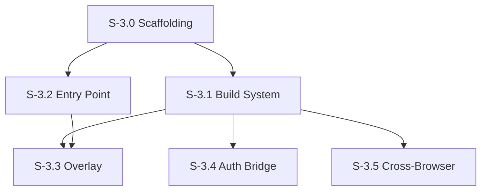

# Milestone 3: Browser Extension Integration

**Goal**: Package the application as a cross-browser extension (Chrome/Edge/Firefox) that seamlessly integrates into the GitHub interface, allowing users to launch the review environment directly from a Pull Request page.

**Horizontal Requirements**:
- **Test Coverage**: 70% unit test coverage (including background/content scripts).
- **E2E Testing**: Launch via Playwright/Puppeteer with extension loading capabilities.
- **Accessibility**: Injected buttons must match GitHub's accessibility standards (focus rings, aria labels).

## Architecture & Scaffolding
*Implementation must follow `spec/ARCHITECTURE.md`. Focus on `features/extension` and Manifest generation.*

## Dependency Graph

---

## [S-3.0] Story 3.0: Extension Architecture Setup

As a developer, I want to configure the build pipeline to generate browser extension assets so I can run the app in a browser context.

### Description
Set up `manifest.json` generation scripts (or `vite-plugin-web-extension`). Create entry points for Content Scripts and Background Scripts.

### Acceptance Criteria
1.  **Build Config**:
    - [ ] [AC-3.0.1] Vite config updated to output `dist/extension`.
    - [ ] [AC-3.0.2] `content-script.ts` entry point configured.
2.  **App Mount**:
    - [ ] [AC-3.0.3] Logic to switching between 'Web Mode' (Root div) and 'Extension Mode' (Shadow DOM injection).

---

## [S-3.1] Story 3.1: Extension Manifest & Build System

As a developer, I want a unified build system that produces valid extensions for Chrome, Edge, and Firefox so that we don't have to maintain separate codebases.

### Description
Set up the project to build `manifest.json` (Manifest V3 for Chrome/Edge, V2/V3 for Firefox compatibility). Ensure the React SPA can be bundled into the extension assets.

### Acceptance Criteria
1.  **Build Output**:
    - [ ] [AC-3.1.1] `npm run build:extension` produces a `dist/extension` folder.
    - [ ] [AC-3.1.2] Can load unpacked extension in Chrome and Firefox Developer Edition.
2.  **Manifest Compliance**:
    - [ ] [AC-3.1.3] Valid V3 manifest for Chrome.
    - [ ] [AC-3.1.4] Appropriate permissions (`activeTab` or `host_permissions` for github.com).

---

## [S-3.2] Story 3.2: "Review with CodjiFlo" Entry Point

As a user, I want to see a button on the GitHub PR page so that I can easily switch to the enhanced review mode.

### Description
Inject a content script on pages matching `https://github.com/*/*/pull/*`. Detect the DOM location of the "Code" or "Files changed" tabs and insert a visually consistent button.

### Acceptance Criteria
1.  **Placement**:
    - [ ] [AC-3.2.1] Button appears near the "Files changed" tab or the "Review changes" dropdown.
    - [ ] [AC-3.2.2] Style matches GitHub's "Primary" or "Secondary" button styles (using Primer CSS classes or mimicking found styles).
2.  **Robustness**:
    - [ ] [AC-3.2.3] Button appears even if navigating via Turbo/PJAX (GitHub's SPA navigation) without full page reload.
    - [ ] [AC-3.2.4] `MutationObserver` ensures button is re-injected if DOM changes.
3.  **Accessibility**:
    - [ ] [AC-3.2.5] Button has `aria-label="Open review in CodjiFlo"`.
    - [ ] [AC-3.2.6] Focusable via standard Tab navigation on the GitHub page.

---

## [S-3.3] Story 3.3: Overlay View Injection

As a user, I want the CodjiFlo interface to open as an immersive overlay on top of GitHub so that I don't lose my place in the browser.

### Description
When the entry button is clicked, mount the React application into a Shadow DOM container injected into the page `body`. This prevents CSS pollution between GitHub and CodjiFlo.

### Acceptance Criteria
1.  **Opening**:
    - [ ] [AC-3.3.1] Click opens a full-screen modal/overlay.
    - [ ] [AC-3.3.2] Background body scroll is disabled on the parent page.
    - [ ] [AC-3.3.3] URL remains (or updates hash) so the user is still on the GitHub PR URL.
2.  **Closing**:
    - [ ] [AC-3.3.4] "Exit" or "X" button returns to standard GitHub view.
    - [ ] [AC-3.3.5] `Esc` key closes the overlay.
3.  **Isolation**:
    - [ ] [AC-3.3.6] CodjiFlo styles do not break GitHub page styles.
    - [ ] [AC-3.3.7] GitHub styles do not bleed into CodjiFlo (Shadow DOM used).

---

## [S-3.4] Story 3.4: Authentication Bridge

As a user, I want to use my existing GitHub session so I don't have to login again.

### Description
The extension should attempt to reuse the user's implicit session if possible (via direct API calls from the origin `github.com` which includes cookies), or prompt for a simpler handshake.
*Note: As an extension running on github.com, fetch requests to github.com/api usually carry the session cookies automatically if credentials are included.*

### Acceptance Criteria
1.  **Auto-Auth**:
    - [ ] [AC-3.4.1] API requests referenced in Milestone 1 & 2 work without manually pasting a PAT.
    - [ ] [AC-3.4.2] If 401/403 is received, fallback to PAT input prompt (from Story 1.1).
2.  **Security**:
    - [ ] [AC-3.4.3] We do not exfiltrate the session cookie; we just rely on the browser attaching it to requests made from the content script context (or background script with host permissions).

---

## [S-3.5] Story 3.5: Firefox & Edge Support

As a user of Firefox or Edge, I want the same experience as Chrome users.

### Description
Verify and adjust manifest/APIs for cross-browser support.

### Acceptance Criteria
1.  **Verification**:
    - [ ] [AC-3.5.1] Manual smoke test on Firefox.
    - [ ] [AC-3.5.2] Manual smoke test on Microsoft Edge.
