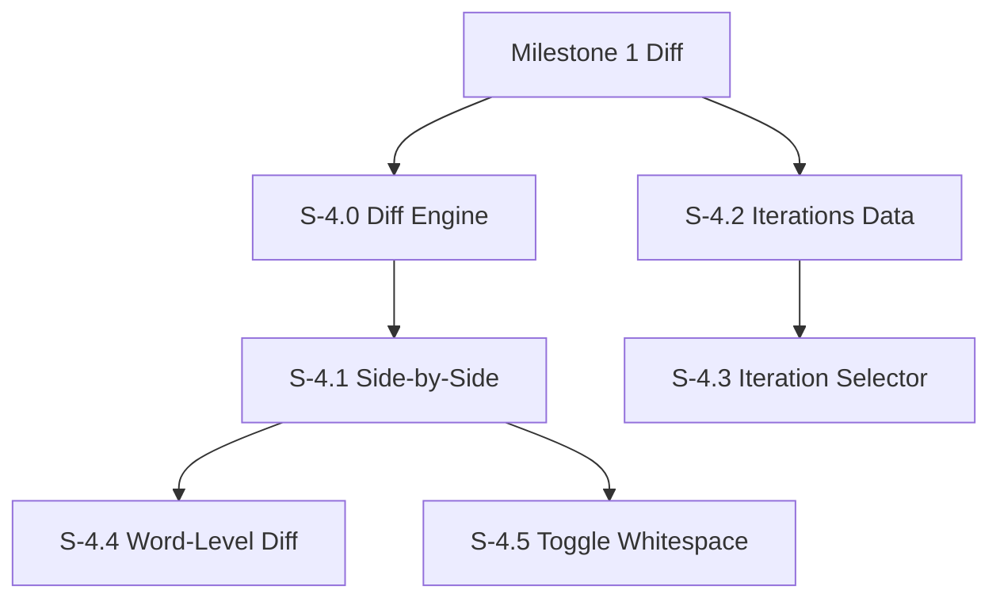

# Milestone 4: Advanced Diff & Iteration Management

**Goal**: Implement the core "CodeFlow-like" diffing capabilities, including side-by-side viewing, word-level precision, and the ability to compare arbitrary iterations (review versions).

**Horizontal Requirements**:
- **Test Coverage**: 70% coverage. Complex diff logic (Word-level algorithms) requires comprehensive unit tests.
- **Accessiblity**: Screen reader support for side-by-side view (announcing "Left side" vs "Right side" context).

## Architecture & Scaffolding
*Implementation must follow `AGENTS.md` (root). Focus on `workers/diff-worker.ts`.*

## Dependency Graph

---

## [S-4.0] Story 4.0: Diff Engine Scaffolding (Web Worker)

As a developer, I want to compute diffs in a background thread so that the UI remains responsive even for large files.

### Description
Set up a Web Worker infrastructure to handle text diffing algorithms (e.g., using `diff-match-patch` or `myers-diff`).

### Acceptance Criteria
1.  **Worker Setup**:
    - [ ] [AC-4.0.1] `diff.worker.ts` created.
    - [ ] [AC-4.0.2] Async message passing interface defined (`computeDiff(textA, textB) -> DiffResult`).

---

## [S-4.1] Story 4.1: Side-by-Side Diff View

As a reviewer, I want to see the original and modified files side-by-side so that I can easily compare the context of changes.

### Description
Implement the Split View mode.
- Left Pane: Original content ("Base").
- Right Pane: Modified content ("Head").
- Synchronized scrolling.

### Acceptance Criteria
1.  **Layout**:
    - [ ] [AC-4.1.1] Two vertical panes of equal width (resizable optional for now).
    - [ ] [AC-4.1.2] Left pane shows content from base commit.
    - [ ] [AC-4.1.3] Right pane shows content from target commit.
2.  **Scroll Sync**:
    - [ ] [AC-4.1.4] Scrolling one pane scrolls the other precisely.
    - [ ] [AC-4.1.5] "Spacer" blocks inserted to align unchanged lines when one side has additions/deletions.
3.  **Visuals**:
    - [ ] [AC-4.1.6] Deleted lines in Left Pane (Red).
    - [ ] [AC-4.1.7] Added lines in Right Pane (Green).
4.  **Accessibility**:
    - [ ] [AC-4.1.8] Screen reader focus can move between panes.
    - [ ] [AC-4.1.9] Aria labels "Original version" and "Modified version".

---

## [S-4.2] Story 4.2: Iterations Data Fetching

As a reviewer, I want to see which updates were pushed to the PR so I can track progress.

### Description
Fetch the list of commits/pushes. In GitHub, this often maps to the "Commits" list or specific "Force Push" events. For "Iterations", we might treat each push (or group of commits) as an iteration.
*Note: GitHub doesn't have native "Iteration" objects like Azure DevOps. We simulate this by listing commits or using the `/pulls/{number}/commits` endpoint to build a list of selectable checkpoints.*

### Acceptance Criteria
1.  **Data Processing**:
    - [ ] [AC-4.2.1] Fetch all commits for the PR.
    - [ ] [AC-4.2.2] Group commits by push date or treat each commit as selectable point (simpler).
2.  **Store**:
    - [ ] [AC-4.2.3] Store a list of selectable "Versions" (e.g., "Main", "Commit A", "Commit B", "Latest").

---

## [S-4.3] Story 4.3: Iteration Selector & Comparison

As a reviewer, I want to compare "Last Reviewed" vs "Latest" so I only see what's new.

### Description
Provide a selector mechanism to choose:
- **Base**: (Defaults to Target Branch / Main).
- **Head**: (Defaults to Source Branch / Latest).
Allow user to change any combination (e.g., Compare Commit A vs Commit B).

### Acceptance Criteria
1.  **UI Controls**:
    - [ ] [AC-4.3.1] Two dropdowns: "Start Point" and "End Point" (or specialized "Since last review" preset).
    - [ ] [AC-4.3.2] "Update View" button (or auto-update) to trigger diff fetch.
2.  **Diff Logic**:
    - [ ] [AC-4.3.3] Fetch diff data for `GET /repos/{owner}/{repo}/compare/{base}...{head}`.
    - [ ] [AC-4.3.4] Update Diff View (Story 1.4 / 4.1) with the resulting patch.
3.  **Accessibility**:
    - [ ] [AC-4.3.5] Dropdowns are labeled "Compare from" and "Compare to".

---

## [S-4.4] Story 4.4: Word-Level Diff Highlighting

As a reviewer, I want to see exactly which variable changed in a line so I don't have to scan the whole line.

### Description
Refine the diff visualization. For lines that are modified (not fully added/removed), run a sub-line diff algorithm (e.g., `diff-match-patch`) to highlight specific character/word changes.

### Acceptance Criteria
1.  **Visualization**:
    - [ ] [AC-4.4.1] Modified lines show a lighter background color.
    - [ ] [AC-4.4.2] Specific changed characters/words show a darker/saturated background color.
2.  **Algorithm**:
    - [ ] [AC-4.4.3] Only runs on pairs of lines identified as "Modified".
    - [ ] [AC-4.4.4] correctly identifies common changes (variable rename, argument change).
3.  **Accessibility**:
    - [ ] [AC-4.4.5] Screen reader announces "Line X modified. Original: [...], New: [...]". (Ideal world: also announces specific diffs, but typically full line read is standard for A11y).

---

## [S-4.5] Story 4.5: Toggle Whitespace

As a reviewer, I want to ignore whitespace changes so I can focus on code logic.

### Description
Add a settings toggle "Ignore Whitespace".

### Acceptance Criteria
1.  **Functionality**:
    - [ ] [AC-4.5.1] Toggle ON: Re-fetches or re-renders diff with `?w=1` (GitHub API supports whitespace ignore) or filters out whitespace-only hunks client-side.
    - [ ] [AC-4.5.2] Toggle OFF: Standard view.
2.  **Persistence**:
    - [ ] [AC-4.5.3] Setting is saved in local storage.
