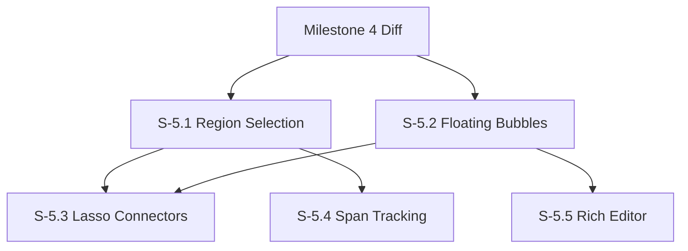

# Milestone 5: Full Commenting Capabilities

**Goal**: Implement the signature "CodeFlow" commenting experience with floating bubbles, region spanning, and sophisticated position tracking, moving beyond the simple "inline list" of Milestone 2.

**Horizontal Requirements**:
- **Test Coverage**: 70% coverage. Geometry/Layout logic for bubbles requires heavy unit testing.
- **Accessibility**: This is critical for floating UI. Bubbles must remain in the DOM structure logically (or be managed carefully with aria-owns) so screen readers can follow the flow. Keyboard navigation between code and bubbles is essential.

- **Accessibility**: This is critical for floating UI. Bubbles must remain in the DOM structure logically (or be managed carefully with aria-owns) so screen readers can follow the flow. Keyboard navigation between code and bubbles is essential.

## Dependency Graph

---

## [S-5.1] Story 5.1: Multi-line / Region Comments

As a reviewer, I want to comment on a block of code (lines 10-15) or a specific part of a line (chars 5-20) so my feedback is precise.

### Description
Enhance the selection mechanism to support range-based comments.

### Acceptance Criteria
1.  **Selection**:
    - [ ] [AC-5.1.1] Users can click-and-drag to select multiple lines.
    - [ ] [AC-5.1.2] Users can select a sub-string within a line.
    - [ ] [AC-5.1.3] Floating "+" button appears near the selection end.
2.  **Data Model**:
    - [ ] [AC-5.1.4] Comment payload stores `startLine`, `endLine`, `startColumn`, `endColumn`.
    - [ ] [AC-5.1.5] Backend (via GitHub API) maps this to the `subject_type: line` or `file` (GitHub API is limited here, we might need to store precise spans in the comment body metadata or a sidecar database if GitHub API doesn't support column-level naturally. *Constraint: "only covering what GitHub supports" implies we might interpret standard multi-line comments from GitHub, which are supported in API*).
    - [ ] [AC-5.1.6] **Clarification**: GitHub supports `start_line` and `line` for multi-line comments. It does *not* natively support column-level comments in the UI, but we can store it in metadata if we want the UI to render it precisely, or just fallback to line-level for persistence.
3.  **Visualization**:
    - [ ] [AC-5.1.7] Selected region highlights in the editor (yellow/blue background).

---

## [S-5.2] Story 5.2: Floating Comment Bubbles

As a reviewer, I want comments to appear as floating bubbles next to the code so they don't break the reading flow of the code itself.

### Description
Implement the "Canvas" or "Overlay" layer for comments. Use a separate layout engine to position comment cards to the right (or left) of the code, preventing overlap with each other.

### Acceptance Criteria
1.  **Visuals**:
    - [ ] [AC-5.2.1] Comments are displayed in cards/bubbles outside the text flow (in the margin/gutter area).
    - [ ] [AC-5.2.2] Width is fixed or responsive (~300px).
2.  **Layout Algorithm**:
    - [ ] [AC-5.2.3] Bubbles stack vertically.
    - [ ] [AC-5.2.4] If many comments exist on one line, they stack without overlapping (pushing each other down).
    - [ ] [AC-5.2.5] "Fan out" behavior: If bubbles move too far from their code line, they remain visually connected.
3.  **Accessibility**:
    - [ ] [AC-5.2.6] **Key Requirement**: The DOM order should ideally reflect the logical order. If using absolute positioning, ensure `tabindex` flows correctly from Code Line -> Comment -> Next Code Line (or provide a "Jump to comments" shortcut).

---

## [S-5.3] Story 5.3: Lasso Connectors

As a reviewer, I want to clearly see which code connects to which comment bubble, especially when they are pushed apart by layout.

### Description
Draw SVG bezier curves or lines connecting the highlighted code region (Story 5.1) to the Comment Bubble (Story 5.2).

### Acceptance Criteria
1.  **Rendering**:
    - [ ] [AC-5.3.1] SVG overlay layer on top of the editor.
    - [ ] [AC-5.3.2] Lines connect the center-right of the code selection to the center-left of the comment bubble.
    - [ ] [AC-5.3.3] Lines update smoothly on scroll.
2.  **Interactivity**:
    - [ ] [AC-5.3.4] Hovering a bubble highlights the connector and the code region.
    - [ ] [AC-5.3.5] Hovering the code region highlights the connector and the bubble.

---

## [S-5.4] Story 5.4: Span Tracking Persistence

As a reviewer, I want my comments to stay attached to the correct logic even if I switch to a newer iteration where line numbers have changed.

### Description
Implement the "Span Tracking" logic described in `diff-viewing.md`.
Use the diff between Iteration A and Iteration B to calculate the new position of a comment left on Iteration A.

### Acceptance Criteria
1.  **Forward Tracking**:
    - [ ] [AC-5.4.1] If I commented on Line 10 in Iteration 1.
    - [ ] [AC-5.4.2] And Iteration 2 adds 5 lines at the top.
    - [ ] [AC-5.4.3] When viewing Iteration 2, the comment appears on Line 15.
2.  **Orphaned Comments**:
    - [ ] [AC-5.4.4] If the commented line was deleted, show the comment in a special "Detached/General" area or attached to the nearest surviving context.

---

## [S-5.5] Story 5.5: Rich Formatting & Reactions

As a reviewer, I want to use bold, code blocks, and emojis in my comments to express myself clearly.

### Description
Upgrade the comment editor (from Story 2.2) to full Markdown support with preview.

### Acceptance Criteria
1.  **Editor**:
    - [ ] [AC-5.5.1] Toolbar for Bold, Italic, Code, Link, List.
    - [ ] [AC-5.5.2] Drag-and-drop image upload (pasting image from clipboard).
2.  **Reactions**:
    - [ ] [AC-5.5.3] Emoji picker for existing comments.
    - [ ] [AC-5.5.4] Display reaction counts (+1, Smile, etc.).
    - [ ] [AC-5.5.5] Sync reactions with GitHub API.
