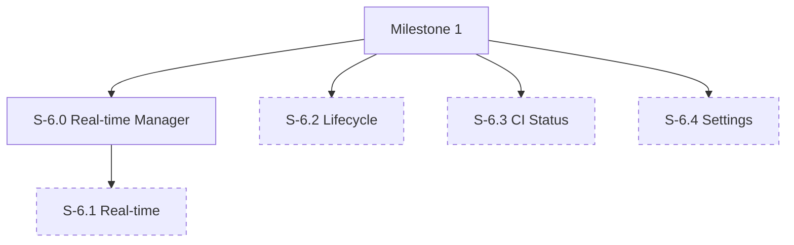

# Milestone 6: Real-time, Lifecycle & Settings (Gap Analysis)

**Goal**: Implement the remaining supporting features ensuring the application is a complete, production-ready review environment. This covers real-time updates, review status management, and personalization.

**Horizontal Requirements**:
- **Test Coverage**: 70% coverage.
- **Accessibility**: Status changes and real-time alerts must be announced via ARIA live regions. Settings panels must be fully accessible.

- **Accessibility**: Status changes and real-time alerts must be announced via ARIA live regions. Settings pannels must be fully accessible.

## Architecture & Scaffolding
*Implementation must follow `spec/ARCHITECTURE.md`. Focus on `api/realtime`.*

## Dependency Graph

---

## [S-6.0] Story 6.0: Real-time Service Manager

As a developer, I want a centralized service to handle polling/socket connections so that the rest of the app just subscribes to updates.

### Description
Implement `RealTimeService` singleton or hook.

### Acceptance Criteria
1.  **Service**:
    - [ ] [AC-6.0.1] `RealTimeService` created with `subscribe(event, callback)`.
    - [ ] [AC-6.0.2] Basic polling loop implementation.

---

## [S-6.1] Story 6.1: Real-time Updates

As a reviewer, I want to see new comments and changes appear instantly without refreshing the page so I'm always looking at the latest state.

### Description
Implement the Real-Time Backend (`IRealTimeBackend`) using a polling fallback (for GitHub) or WebSockets where available.

### Acceptance Criteria
1.  **Mechanism**:
    - [ ] [AC-6.1.1] Poll for changes every X seconds (e.g., 30s) or listen to webhook events if a relay service is available.
    - [ ] [AC-6.1.2] Optimistically update UI when current user performs actions.
2.  **Indicators**:
    - [ ] [AC-6.1.3] specific toast notification when "New updates available" if auto-refresh is disabled.
    - [ ] [AC-6.1.4] or Auto-insert new comments into the thread if they don't conflict.

---

## [S-6.2] Story 6.2: Review Lifecycle Management

As a reviewer, I want to Approve, Request Changes, or Comment on the PR so I can unblock the author.

### Description
Implement the "Submit Review" flow aligned with GitHub's "Review" object.

### Acceptance Criteria
1.  **Review Dialog**:
    - [ ] [AC-6.2.1] "Review Changes" button in the header.
    - [ ] [AC-6.2.2] Dropdown with "Comment", "Approve", "Request Changes" options.
    - [ ] [AC-6.2.3] Text area for overall review summary.
2.  **Batching**:
    - [ ] [AC-6.2.4] (If not implemented in M2) Support "Pending Comments" that are only sent when the review is submitted.
3.  **Submission**:
    - [ ] [AC-6.2.5] POST `/pulls/{number}/reviews`.
    - [ ] [AC-6.2.6] Update local PR state badge immediately.

---

## [S-6.3] Story 6.3: CI/CD Build Status

As a reviewer, I want to see if the tests passed before I spend time reviewing the code.

### Description
Display the status of GitHub Actions or distinct Check Runs.

### Acceptance Criteria
1.  **Visibility**:
    - [ ] [AC-6.3.1] Show combined status (Green Check / Red X) in the header.
    - [ ] [AC-6.3.2] Detailed list of checks in a "Checks" tab or dropdown.
2.  **Gating**:
    - [ ] [AC-6.3.3] Warn user if they try to approve a PR with failing checks (visual warning only, don't block API unless GitHub blocks it).

---

## [S-6.4] Story 6.4: Settings & Personalization

As a user, I want to customize the font size and theme to match my preference.

### Description
Implement the `DiffViewerSettings` interface from `diff-viewing.md`.

### Acceptance Criteria
1.  **Options**:
    - [ ] [AC-6.4.1] Font Size (Slider or presets).
    - [ ] [AC-6.4.2] Tab Size (2, 4, 8).
    - [ ] [AC-6.4.3] Theme (Light, Dark, High Contrast, Auto).
    - [ ] [AC-6.4.4] "Show Line Numbers" toggle.
2.  **Persistence**:
    - [ ] [AC-6.4.5] Save to `localStorage`.
    - [ ] [AC-6.4.6] Load improved defaults based on OS (e.g., Dark Mode detection).
